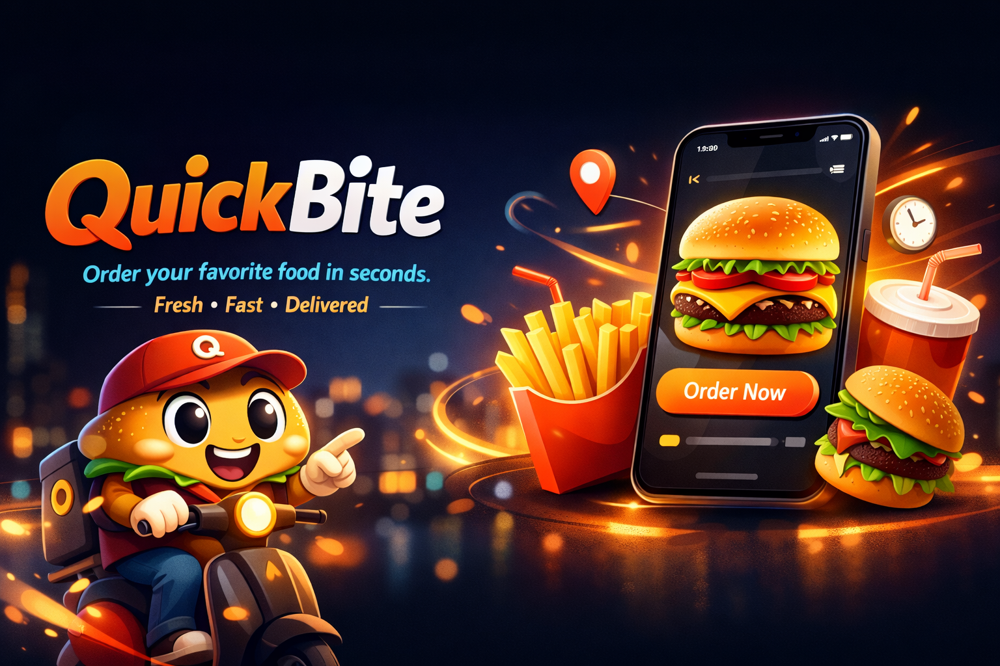

# 🍔 QuickBite

Responsive food ordering web app built with HTML, CSS and JavaScript.
Developed as part of the **Developer Akademie** training program.

---

## 🚀 Tech Stack


---

## 📌 Overview

QuickBite is a fully responsive food ordering web application.

The project focuses on:

- Dynamic rendering of menu items
- Interactive shopping cart functionality
- Real-time price calculation
- Responsive design using Flexbox
- Clean folder structure
- Separation of HTML, CSS and JavaScript

---

## 🎯 Features

- Dynamic food categories
- Add and remove items from cart
- Delivery and pickup option
- Basket with live price updates
- Responsive navigation
- Clean and structured UI

---

## 🖥 Preview

Example:



---

## ⚙️ Installation

```bash
git clone https://github.com/YOUR-USERNAME/quickbite.git
cd quickbite
open index.html
```

---

## 🎓 Project Context

This project was developed during the Developer Akademie training program
to practice dynamic frontend development and interactive UI concepts.

---

## 👨‍💻 Author

Christian Noack
https://christian-noack.com

Software Architecture · Engineering
